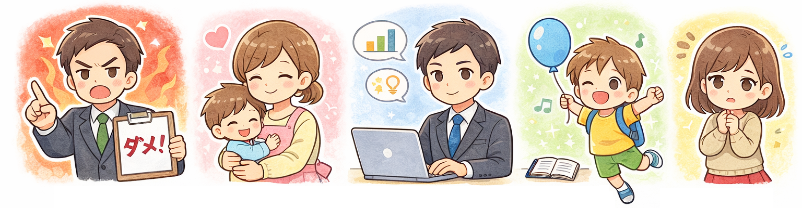
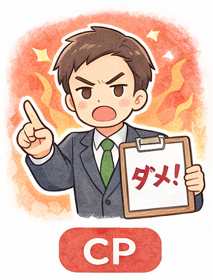
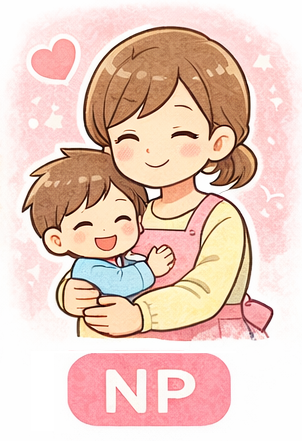
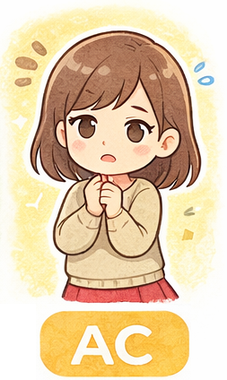
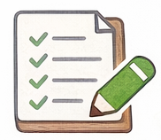

# エゴグラム診断 授業用スライド原稿

---

## 1. 今日の授業の目的 

* 自分の考え方や行動の「傾向」を知る
* 人にはいろいろなタイプがあることを理解する
* 自分や他人を決めつけない見方を身につける

※ この授業は成績や評価とは関係ありません。

---

## 2. エゴグラムとは？

* 心理学の考え方をもとにした「自己理解の道具」
* 性格を決めるものではない
* 今の自分の傾向をグラフで見える化したもの

---

## 3. エゴグラムの5つの尺度

---

### CP（批判的な親）

* ルールや正しさを大切にする
* 責任感・けじめ
---

### NP（養育的な親）

* 思いやり・やさしさ
* 人を支える力

---

### A（大人）

* 冷静に考える
* 情報を整理して判断する

---

### FC（自由な子ども）

* 自由な発想
* 楽しむ・表現する力

---

### AC（順応した子ども）

* 周囲に合わせる
* 協調性・我慢強さ

---

## 4. 大切な考え方

* どの尺度も「良い・悪い」はない
* 高い＝すごい、低い＝ダメ、ではない
* 場面によって使い分けることが大切

---

## 5. 診断を受ける前の約束

* 結果で人を比べない
* 笑ったり、からかったりしない
* 見せたくない人は見せなくてよい

---

## 6. 診断タイム（実施）

* 画面の指示に従って回答
* 直感で選んでOK
* 正解・不正解はありません

---

## 7. 結果の見方（グラフ）

* 線の形に注目する
* 高いところ・低いところを見る
* 「なぜそうなったか」を考える

---

## 8. 結果をどう活かす？

* 得意な場面を知る
* 苦手な場面に気づく
* 行動の選択肢を増やす

---

## 9. 振り返りワーク 

* 納得できたところ
* 意外だったところ
* これから意識したいこと

（個人で考える／共有は任意）

---

## 10. 授業のまとめ

* 人は一人ひとり違う
* 自分を知ることは成長につながる
* 他人の違いを尊重することが大切

<!--
## 教員向け補足（非表示）

* 結果を評価・指導材料にしない
* 特定の尺度を理想化しない
* 安心して話せる雰囲気づくりを優先
-->